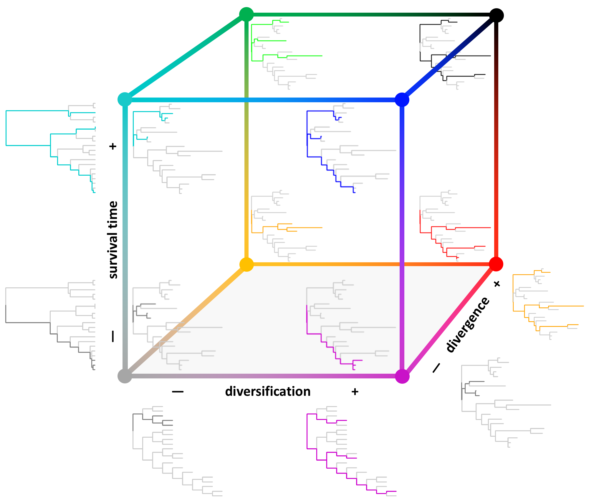

# Facets of phylodiversity

This repository contains supporting material associated with the study: 

[Kling, M., B. Mishler, A. Thornhill, B. Baldwin, and D. Ackerly (2018). Facets of phylodiversity: evolutionary diversification, divergence, and survival as conservation targets. *Philosophical Transactions of the Royal Society B*](https://royalsocietypublishing.org/doi/full/10.1098/rstb.2017.0397).

* A raster file of the dataset we developed representing current [land conservation status](protection_status.tif) on a 0--1 scale, at 810m grain size. 
* An R script with functions implementing our [reserve selection algortihm](prioritize.R).
* A CSV file containing our [prioritization results](rankings.csv). For each 15km grid cell this file contains the spatial coordinates (Albers equal-area, EPSG:3310, 15 km resolution), current conservation status, proportion of the cell in the state, and prioritization rankings for each of six different biodiversity metrics.

Our analysis was based on previously published input datasets that are also available online, including [herbarium records](https://doi.org/10.6078/D1KX0V), [phylogenetic trees](https://doi.org/10.6078/D1VD4P), and [species distribution model](https://doi.org/10.6078/D1QQ2S) scripts.

In addition, a web application associated with the paper, the [California Plant Phylodiversity Atlas](http://ucjeps.berkeley.edu/phylodiversity), provides an interactive interface to the spatial, phylogenetic, and community datasets associated with this project.

